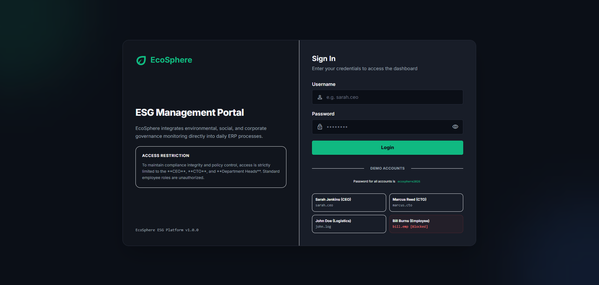
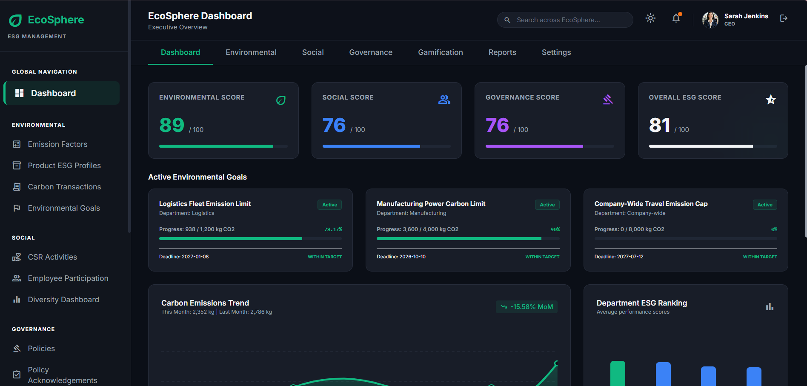
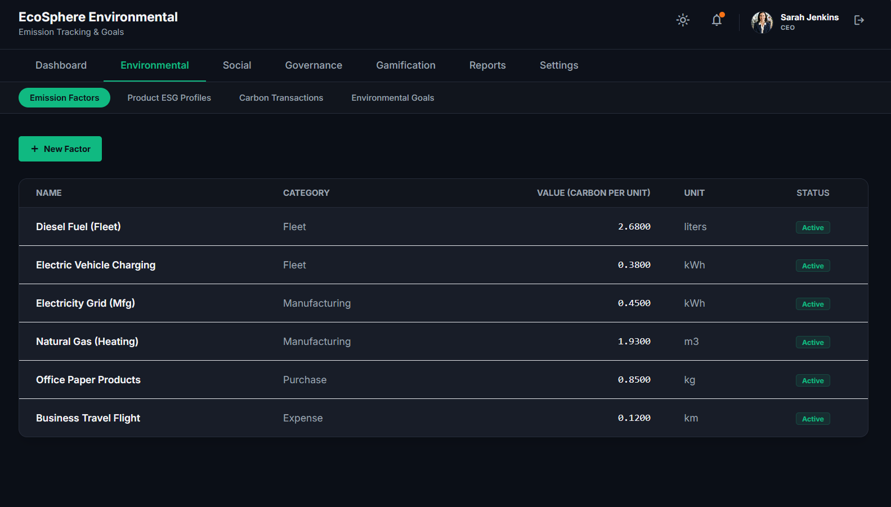
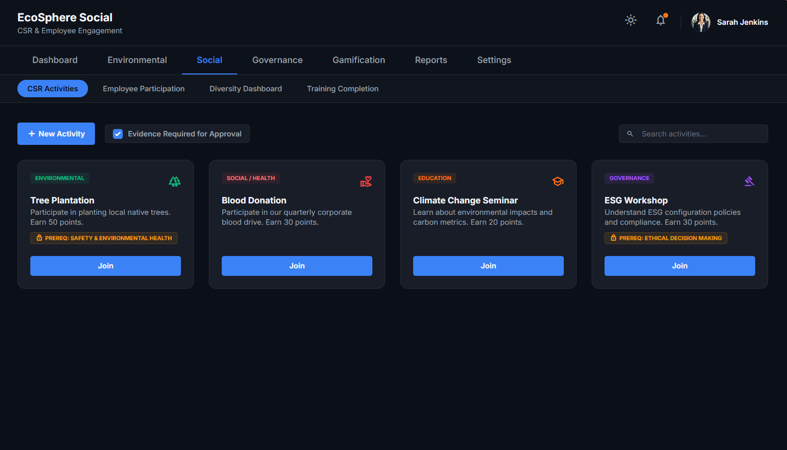
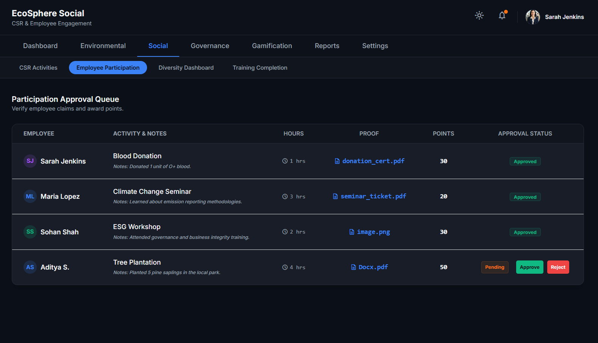

# 🌍 EcoSphere: ESG Management Platform

> Integrate Environmental, Social and Governance (ESG) management directly into day-to-day ERP operations.


---

## 📌 Problem Statement

Environmental, Social and Governance (ESG) has become a critical aspect of modern businesses. Organizations are expected to monitor carbon emissions, promote employee well-being, and maintain governance compliance. While many ERP systems collect operational data, ESG reporting is often manual, disconnected, and difficult to monitor in real time.

---

## 💡 Solution

EcoSphere integrates ESG directly into day-to-day ERP operations by measuring sustainability metrics, encouraging employee participation, and providing meaningful reports for management. It enables organizations to measure, manage and improve their Environmental, Social and Governance performance by bringing operational data, employee participation and compliance activities into a single unified dashboard.

- Unifies Environmental, Social and Governance data in one platform
- Automates carbon emission calculation from existing ERP transactions
- Drives employee engagement through CSR activities and gamification (challenges, XP, badges, rewards, leaderboards)
- Tracks governance policies, audits and compliance issues end-to-end
- Generates real-time, filterable, and exportable ESG reports for management
- Role-based authentication with admin and employee access levels
- Global search across all ESG modules
- Real-time notification system for key events

---

## 🏗️ Tech Stack

| Layer | Technology |
|-------|-----------|
| **Frontend** | HTML5, JavaScript, TailwindCSS, Google Material Symbols |
| **Frontend Tooling** | Vite 5.x (Dev Server & Build) |
| **Backend** | Node.js, Express.js 4.x, TypeScript |
| **ORM** | Sequelize 6.x |
| **Database** | MySQL |
| **Runtime** | tsx (TypeScript execution), nodemon (hot-reload) |

---

## 📁 Project Structure

```
odoo-hackathon/
├── frontend/                    # Client-side application
│   ├── index.html               # Executive ESG Dashboard (main page)
│   ├── login.html               # Authentication page with demo accounts
│   ├── environmental.html       # Environmental module
│   ├── social.html              # Social module
│   ├── governance.html          # Governance module
│   ├── gamification.html        # Gamification module
│   ├── reports.html             # Reports & Export module
│   ├── settings.html            # Settings & Administration
│   ├── package.json             # Frontend dependencies (Vite)
│   └── vite.config.js
│
├── backend/
│   └── Enviornmental/           # Backend API server
│       ├── src/
│       │   ├── app.ts           # Express server entry point + global search API
│       │   ├── seed.ts          # Database seeding script (schema + demo data)
│       │   ├── config/
│       │   │   └── database.ts  # Sequelize + MySQL connection setup
│       │   ├── models/          # Sequelize ORM models
│       │   ├── routes/          # REST API route handlers
│       │   │   ├── environmentalRoutes.ts
│       │   │   ├── socialRoutes.ts
│       │   │   ├── governanceRoutes.ts
│       │   │   └── gamificationRoutes.ts
│       │   ├── controllers/     # Business logic controllers
│       │   └── services/        # Service layer
│       ├── .env                 # Environment variables
│       ├── package.json
│       └── tsconfig.json
│
├── .gitignore
└── Readme.md
```

---

## 🚀 Getting Started

### Prerequisites

- **Node.js** (v18 or later)
- **MySQL** (v5.7+ or v8.x) — running locally on port `3306`
- **npm** (comes with Node.js)

### 1. Clone the Repository

```bash
git clone https://github.com/your-username/odoo-hackathon.git
cd odoo-hackathon
```

### 2. Setup Backend

```bash
cd backend/Enviornmental
npm install
```

Create a `.env` file (or use the existing one):

```env
DATABASE_URL="mysql://root:@localhost:3306/ecosphere_db"
PORT=5000
```

> **Note:** Adjust the MySQL credentials (`root:@`) if your local MySQL setup requires a password.

Seed the database with schema and demo data:

```bash
npm run db:seed
```

Start the backend development server:

```bash
npm run dev
```

The backend API will be available at **http://localhost:5000**.

### 3. Setup Frontend

```bash
cd frontend
npm install
npm run dev
```

The frontend will be available at **http://localhost:5173**.

### 4. Open in Browser

Navigate to **http://localhost:5173/login.html** and login using one of the demo accounts below.

---

## 🔑 Demo Accounts

All demo accounts use the password: **`ecosphere2026`**

| Username | Name | Role | Access |
|----------|------|------|--------|
| `sarah.ceo` | Sarah Jenkins | CEO | Full Admin Access |
| `marcus.cto` | Marcus Reed | CTO | Full Admin Access |
| `john.log` | John Doe | Logistics Manager | Department Access |
| `bill.emp` | Bill Burns | Employee | Blocked (for testing) |

---

# ✨ Features

### 🌱 Environmental Module
- ✅ Configure Emission Factors (category, unit, CO₂ value)
- ✅ Calculate Carbon Emissions (manual or automatic from ERP transactions)
- ✅ Department Carbon Tracking with month-over-month trends
- ✅ Product ESG Profiles with sustainability ratings
- ✅ Sustainability Goals with progress tracking and deadlines
- ✅ Environmental Dashboard with live scorecards

### 🤝 Social Module
- ✅ CSR Activities management (create, search, filter)
- ✅ Employee Participation tracking with proof submission
- ✅ Diversity Dashboard (gender distribution, leadership ethnicity, board diversity)
- ✅ Training Programs and completion tracking
- ✅ CSR hours and engagement metrics

### 🏛️ Governance Module
- ✅ ESG Policies lifecycle management (Draft → Published → Archived)
- ✅ Policy Acknowledgements tracking per employee
- ✅ Audit Records management
- ✅ Compliance Issues with severity, ownership, due dates, and auto-flagging of overdue items

### 🎮 Gamification Module
- ✅ Sustainability Challenges (Draft → Active → Under Review → Completed / Archived)
- ✅ XP System with employee leaderboards
- ✅ Auto-Awarded Badges based on configurable unlock rules
- ✅ Green Rewards Catalog & Points-based Redemption
- ✅ Challenge Participation with evidence submission and admin approval

### 📊 Reports Module
- ✅ Environmental Report
- ✅ Social Report
- ✅ Governance Report
- ✅ ESG Summary Report
- ✅ Custom Report Builder (filter by Department, Date Range, Module, Employee, Challenge, ESG Category)
- ✅ Export as PDF / Excel / CSV

### ⚙️ Settings & Administration
- ✅ Departments Management
- ✅ Category Management
- ✅ ESG Configuration & Business Rules
- ✅ Notification Settings (in-app / email)

### 🔔 Notification System
Real-time notifications triggered by:
- **Policy Published** — When a new ESG policy is created
- **Compliance Issue Raised** — When a new compliance issue is logged
- **Compliance Issue Overdue** — When an open issue passes its due date
- **Challenge Approved** — When a challenge submission is approved
- **Badge Unlocked** — When an employee earns a milestone badge
- **Reward Redeemed** — When an employee redeems a green reward

### 🔍 Global Search
- Cross-module search across the entire EcoSphere platform
- Searches Environmental (emission factors, products, goals), Social (CSR activities, trainings), Governance (policies, audits, compliance issues), and Gamification (challenges, badges, rewards)
- Debounced live search with categorized results dropdown
- Clickable results that navigate directly to the relevant module page

---

## 🗂️ Data Model

### Master Data

| Model | Purpose | Key Fields |
|---|---|---|
| Department | Organizational hierarchy and ESG ownership | Name, Code, Head, Parent Department, Employee Count, Status |
| Emission Factor | Carbon values used during calculations | Name, Category, Value, Unit, Status |
| Product ESG Profile | ESG information linked to products | Product Name, SKU, Carbon Footprint Score, Sustainability Rating |
| Environmental Goal | Sustainability targets | Title, Target Value, Current Value, Unit, Deadline, Status, Department |
| ESG Policy | Governance policies | Title, Description, Owner, Status, Effective Date |
| Badge | Employee achievements | Name, Description, Unlock Rule, Icon |
| Reward | Redeemable incentives | Name, Description, Points Required, Stock, Status |
| Training | Learning programs | Name, Description, Required Hours |
| Employee | Staff records | Name, Email, Gender, Ethnicity, Points, XP, Department |

### Transactional Data

| Model | Purpose | Key Fields |
|---|---|---|
| Carbon Transaction | Stores calculated emissions from ERP operations | Department, Emission Factor, Quantity, CO₂ |
| CSR Activity | Social initiatives organized by the company | Name, Category, Description, Points, Icon |
| Employee Participation | Tracks employee involvement in CSR Activities | Employee, Activity, Proof, Hours, Approval Status |
| Challenge | Sustainability challenges | Title, Description, XP, Difficulty, Evidence Required, Deadline, Status |
| Challenge Participation | Tracks employee progress within Challenges | Challenge, Employee, Proof, Approval, XP Awarded |
| Policy Acknowledgement | Employee policy acceptance | Policy, Employee, Acknowledged Date |
| Audit | Governance audits | Title, Auditor, Audit Date, Status |
| Compliance Issue | Governance violations | Audit, Description, Severity, Owner, Due Date, Status |
| Department Score | Aggregated ESG performance per department | Department, Environmental Score, Social Score, Governance Score, Total Score |
| Notification | System notifications | Type, Message, Read Status, Timestamp |
| Redemption | Reward redemptions | Employee, Reward, Timestamp |

---

## 🔄 Business Workflow

```
Master Configuration
        │
        ▼
Departments · Emission Factors · Products
Goals · Policies · Challenges · Badges · Rewards
        │
        ▼
Daily Business Operations
(Purchase • Manufacturing • Expenses • Fleet)
        │
        ▼
Carbon Transactions
        │
        ▼
Employee Participation (CSR) · Challenge Participation
Policy Acknowledgements · Audits
        │
        ▼
Environmental Score   Social Score   Governance Score
        │
        ▼
Department Total Score
        │
        ▼
Overall ESG Score
(weighted average — default: Environmental 40% / Social 30% / Governance 30%)
        │
        ▼
Organization Dashboard & Reports
```

---

## ⚖️ Core Business Rules

- **Reward Redemption** — Employees can redeem earned Points for a Reward from the catalog, subject to stock availability. Redeeming a Reward deducts the corresponding Points from the employee's balance.
- **Notification System** — Sends in-app notifications for: new compliance issues raised, challenge approval decisions, policy acknowledgement reminders, badge unlocks, and reward redemptions.
- **Auto Emission Calculation** — When enabled, Carbon Transactions are calculated automatically from linked ERP records using the relevant Emission Factor.
- **Evidence Requirement** — When enabled, CSR Activity participation cannot be marked Approved without an attached proof file.
- **Badge Auto-Award** — Badges are automatically assigned to an employee the moment their XP, completed-challenge count, or other tracked metric satisfies that Badge's Unlock Rule.
- **Compliance Issue Ownership** — Every Compliance Issue must have an assigned Owner and a Due Date; issues that pass their Due Date while still Open are auto-flagged.

---

## 🔌 API Endpoints

### Environmental
| Method | Endpoint | Description |
|--------|----------|-------------|
| GET | `/api/environmental/dashboard` | Executive dashboard data |
| POST | `/api/environmental/auth/login` | User authentication |

### Social
| Method | Endpoint | Description |
|--------|----------|-------------|
| GET | `/api/social/*` | CSR activities, participations, diversity, trainings |

### Governance
| Method | Endpoint | Description |
|--------|----------|-------------|
| GET | `/api/governance/*` | Policies, audits, compliance issues |

### Gamification
| Method | Endpoint | Description |
|--------|----------|-------------|
| GET | `/api/gamification/*` | Challenges, badges, rewards, leaderboards |

### System
| Method | Endpoint | Description |
|--------|----------|-------------|
| GET | `/api/search?q=` | Global cross-module search |
| GET | `/api/notifications` | Fetch notifications |
| POST | `/api/notifications/clear` | Mark all notifications as read |
| GET | `/health` | Health check |

---

## 📸 Screenshots

### Login Page


### Executive Dashboard


### Environmental Module — Emission Factors


### Social Module — CSR Activities


### Social Module — Employee Participation


---

## 🎥 Demo

Video Demo:
```
https://youtu.be/your-demo-video
```

Mockup:
```
https://link.excalidraw.com/l/65VNwvy7c4X/2m6lz9Ln4
```

---

## 👥 Team

| Name |
|------|
| Amogh Samji |
| Chinmay B Sabarad |
| Subhash Reddy |

---

## 🛣️ Future Scope

- AI-powered ESG recommendations and anomaly detection
- Mobile-responsive PWA interface
- Cloud deployment (AWS / GCP / Azure)
- Advanced predictive analytics and forecasting
- Third-party ERP integrations (Odoo, SAP, NetSuite)
- Email notification delivery
- Multi-organization / multi-tenant support

---

## 🤝 Contributing

Contributions are welcome!

1. Fork the repository
2. Create a feature branch
```bash
git checkout -b feature-name
```
3. Commit changes
```bash
git commit -m "Added new feature"
```
4. Push
```bash
git push origin feature-name
```
5. Open a Pull Request

---

## 📜 License

This project is licensed under the MIT License.

---

## ❤️ Acknowledgements

- Odoo
- Odoo Hackathon
- Open Source Community

---

## ⭐ If you like this project, don't forget to star the repository!
